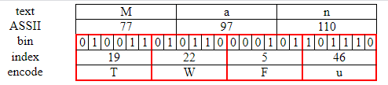

transform binary data to string

can be use on img, like this `src="data:image/png;base64...`

## example

* 将 'M', 'a', 'n', 3 * 8 bit 分成一组

* 将 24 bit 分成 6 bit 一组，每组前面补0，得到4个base64编码表的索引

* 在 base64 编码表查询，得到 'T', 'W', 'F', 'u'
